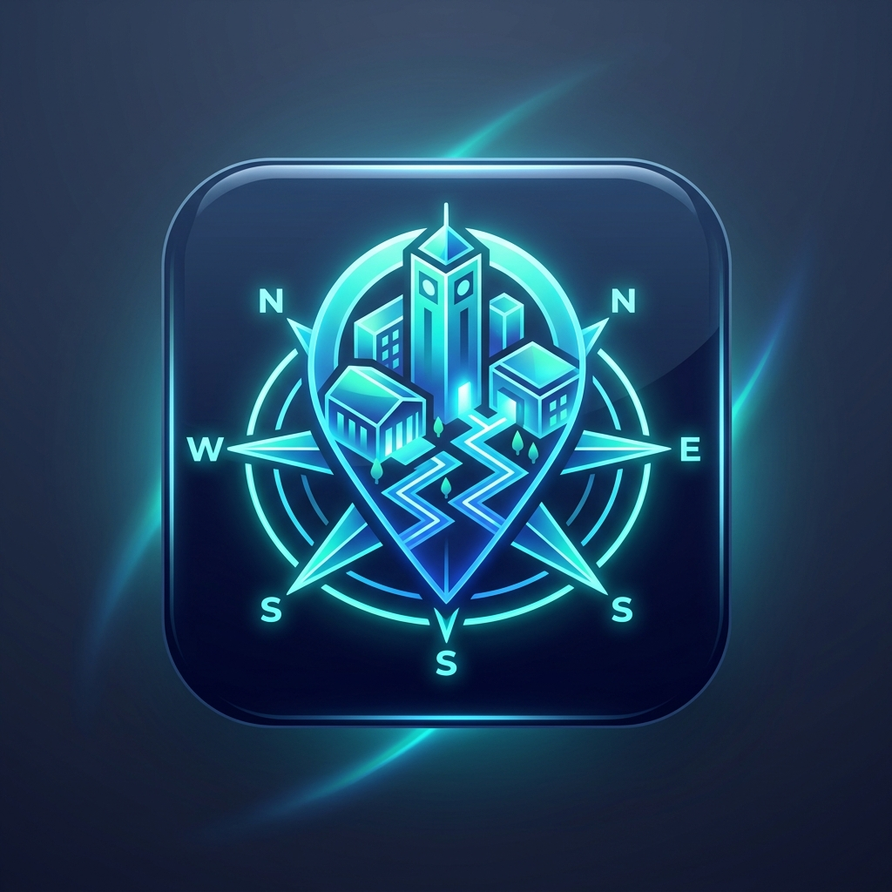

# 🧭 Campus Navigation — BIT Sathy

> An intelligent, responsive web-based campus navigation system engineered for **Bannari Amman Institute of Technology (BIT Sathy)**, Sathyamangalam.



---

## 🌟 Key Features

- **🗺️ High-Resolution Planar Campus Map:**
  - Calibrated unprojected canvas ($3392 \times 3913$ px) powered by Leaflet `CRS.Simple`.
  - Switch between **Architectural Blueprint** and **Satellite Aerial View**.
  - High-contrast pedestrian walkway overlay.

- **🛣️ Strict Dark Blue Walkway Routing:**
  - $A^*$ algorithm strictly constrained to the 14,898 walkable grid cells extracted from the university master layout (`paths.png`).
  - Zero illegal diagonal shortcuts across lawns or buildings.

- **🧭 Google Maps-Style Navigation HUD:**
  - Animated flowing route polyline (`stroke-dashoffset` animation).
  - Green Google Maps top turn guidance banner (e.g., *"In 30m turn right"*).
  - Bottom dashboard showing remaining time (min), distance (m), and estimated arrival clock (ETA).

- **🤖 Campus AI Assistant ("BIT Sathy AI Guide"):**
  - Natural language route planning (e.g., *"Take me from Main Gate to Central Library"*).
  - Campus knowledge & recommendations (Canteens, ATMs, Fees/COE, Hostels, Labs, Medical Centre).
  - Built-in **Voice Recognition** for hands-free speech input.
  - 1-click **"Start Navigation"** from any AI recommendation.

- **🔍 AI Semantic Search:**
  - Search by intent (e.g. typing *"coffee"*, *"fee"*, *"doctor"*, *"bus"*, or *"gym"* highlights corresponding campus facilities).

- **🔐 Student Authentication:**
  - Supports `@bitsathy.ac.in` student/faculty email addresses.
  - Instant **Guest / Visitor Mode** for parents and campus guests.
  - 1-Click Demo Login for testing.

---

## 🚀 Getting Started

### Prerequisites
- Node.js (v18 or higher)
- npm or yarn

### Installation & Local Setup

```bash
# Clone the repository
git clone https://github.com/IRFAN-R25/<your-repo-name>.git
cd <your-repo-name>

# Install dependencies
npm install

# Start Vite development server
npm run dev
```

Open `http://localhost:3000` in your web browser.

### Production Build

```bash
npm run build
npm run preview
```

---

## 🛠️ Tech Stack

- **Frontend:** React 19, Tailwind CSS, Lucide Icons
- **Map Engine:** Leaflet, React Leaflet (`CRS.Simple`)
- **Pathfinding:** Custom $A^*$ Search Engine + Ramer-Douglas-Peucker (RDP) Simplification
- **Bundler:** Vite 6
- **Storage:** LocalStorage (Session & POI Persistence)

---

## 📄 License
MIT License. Built for students, faculty, and visitors of Bannari Amman Institute of Technology.
